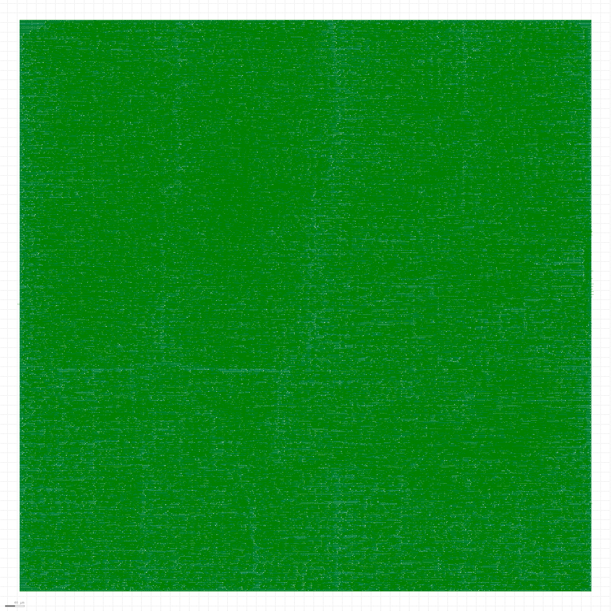
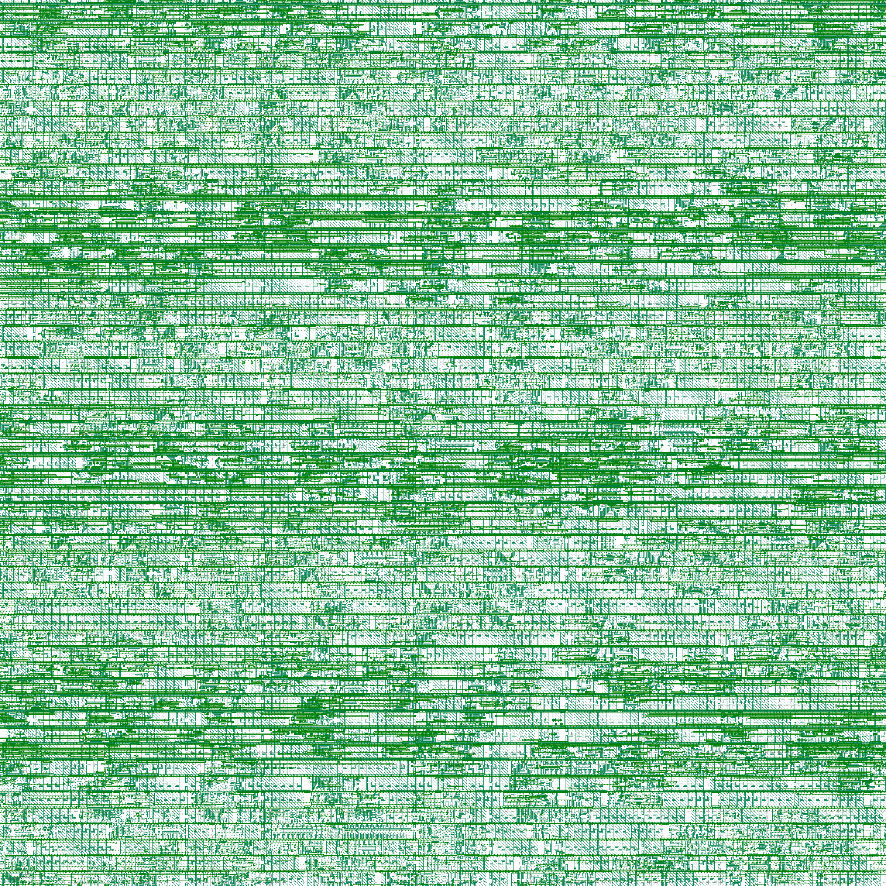

# MINERVA

A RISC-V SoC built in phases on a ZedBoard, then taken to GDS on Sky130.

Each phase was verified on hardware before the next one started. The design is a
5-stage RV32I pipeline with an L1 cache, a DMA engine, an AXI4-Lite crossbar and
a fault-injection master; the last phase measured how single-bit upsets propagate
through it and hardened the same RTL into a layout.

---

## Current state

|                    |                                                                                                   |
| ------------------ | ------------------------------------------------------------------------------------------------- |
| **FPGA**     | ZedBoard (Zynq-7020), 100 MHz, hardware-verified through P4                                       |
| **ASIC**     | Sky130 HD, 33 MHz timing-clean across all nine PVT corners                                        |
|                    | 1.47 mm², 128,124 cells, 33.7 mW                                                                 |
|                    | DRC 0, LVS 0, antenna 0                                                                           |
|                    | Post-route netlist proven to execute the test workload                                            |
| **Campaign** | 1,312 single-bit injections, matching an independent reference model on all 1,256 classified runs |

---

## Phases

| Phase            | What it built                                                                    | Status            | Repo                                                                       |
| ---------------- | -------------------------------------------------------------------------------- | ----------------- | -------------------------------------------------------------------------- |
| **P1**     | Heterogeneous CDC FIFO arbiter                                                   | Hardware-verified | [hetrogeneousCDCArbitrer](https://github.com/Jehka/hetrogeneousCDCArbitrer) |
| **P2**     | 5-stage RV32I pipeline, hazards and forwarding                                   | Hardware-verified | [RISCV](https://github.com/Jehka/RISCV)                                     |
| **P3–P4** | L1 cache, DMA, AXI4-Lite crossbar, AXI instruction fetch, fault-injection master | Hardware-verified | [P4_RISCV](https://github.com/Jehka/P4_RISCV)                               |
| **P5**     | Fault-injection campaigns, RTL→GDS on Sky130                                    | Complete          | this repo —[writeup](docs/P5.md)                                           |

---

## P5 highlights

**The campaign.** An exhaustive single-bit sweep over every instruction and data
word of a running program: 49% silent data corruption, 30% hang or no result,
21% masked. Vulnerability by bit position tracks the RISC-V encoding — the
opcode field is the most destructive, bit 31 (immediate sign) is the single worst
bit, funct3 the most benign.

**The reference model.** An RV32I interpreter plus a model of this SoC's cache
and address map predicts the outcome of all 1,312 injections. Hardware and model
agree on 1,256 of 1,256 classified runs. Every disagreement found along the way
was a bug — three in the model, one in the test harness.

**Two bugs in a design that had passed bring-up.** A reset-domain split that
deadlocked the AXI fabric roughly 1 run in 6, invisible when the CPU is reset
once and fatal when it is reset 1,312 times. And a harness state leak that made
four classifications order-dependent.

**What the FPGA hid.** A 32-bit magnitude compare in the DMA that Vivado maps to
carry logic for free and Yosys expands into a 15-level ripple chain — the
critical path of the entire hardened design. Replaced with a reduction, with
equivalence proved by SAT miter rather than assumed.

Full detail: [docs/P5.md](docs/P5.md)

---

## Layout





---

## Repository layout

```
rtl/          core, memory, interconnect, and the ASIC top
sim/          testbenches, including the gate-level one
sw/           bring-up and campaign software, reference model
asic/         LibreLane config, SDC, results
scripts/      build and simulation runners
docs/         phase writeups
```

## Reproducing

```bash
sv2v -DSYNTHESIS --write=build/asic_sv2v/minerva.v -Irtl/common <rtl files>
librelane asic/config.json      # harden
./scripts/gate_sim.sh           # prove the netlist executes code
```

Tools: Vivado/Vitis 2025.2 for the FPGA side; sv2v, LibreLane (Yosys, OpenROAD,
Magic, KLayout, OpenSTA), Icarus and Verilator for the ASIC side.

## Next

SRAM macro integration to replace the flop-array memories, and the forwarding→
branch→flush path that currently sets the maximum frequency.

## License

Apache 2.0 — see [LICENSE](LICENSE).
