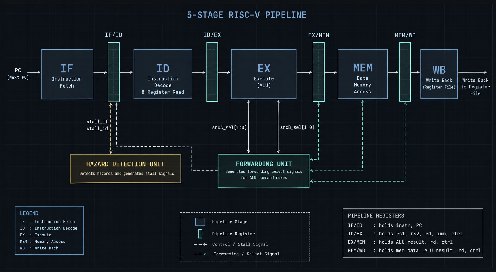
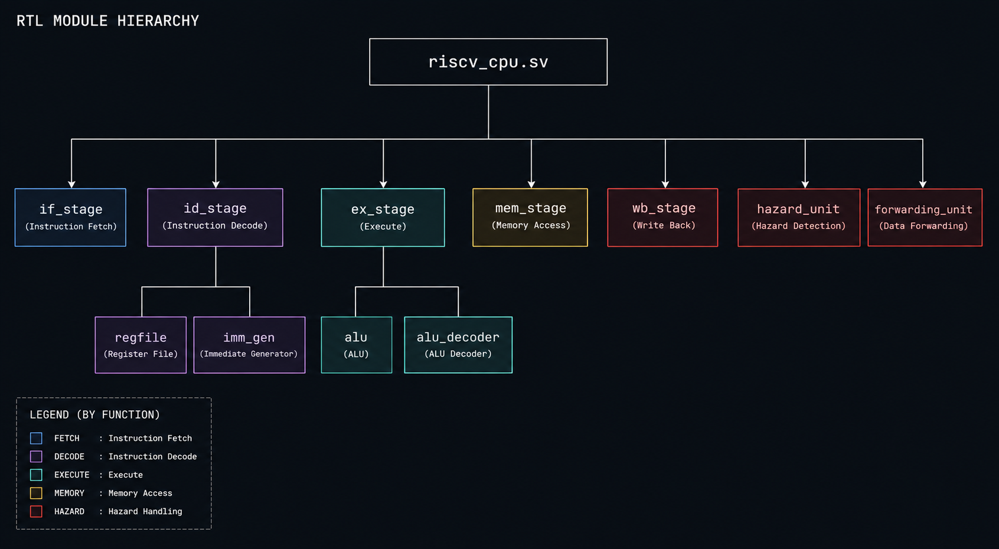
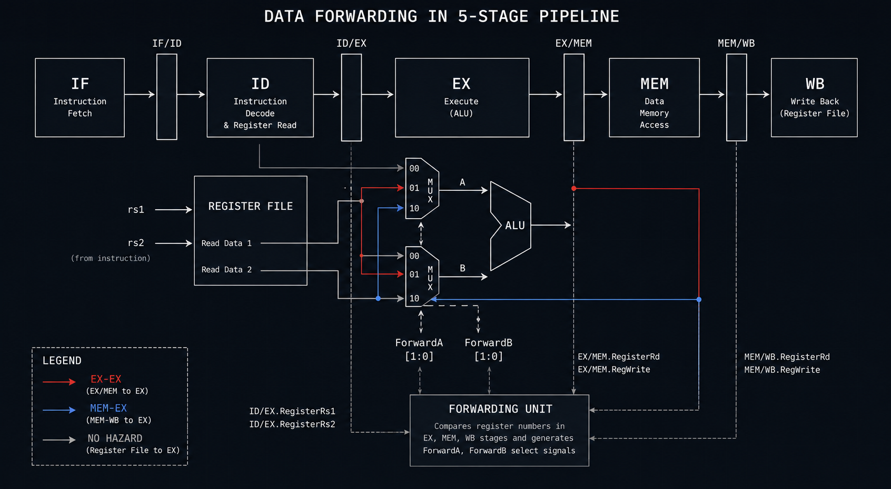
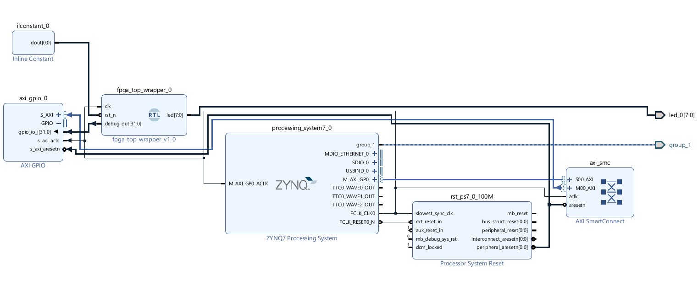
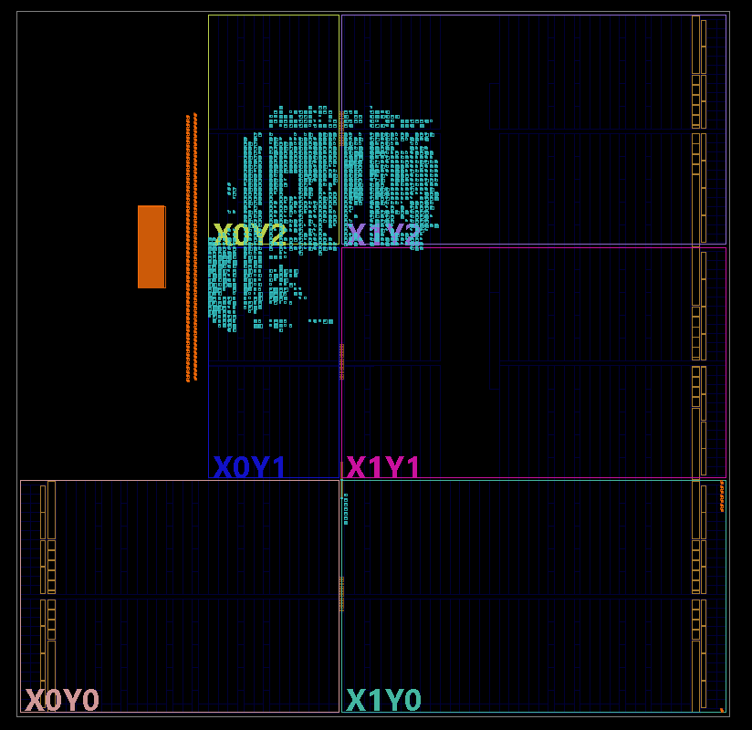
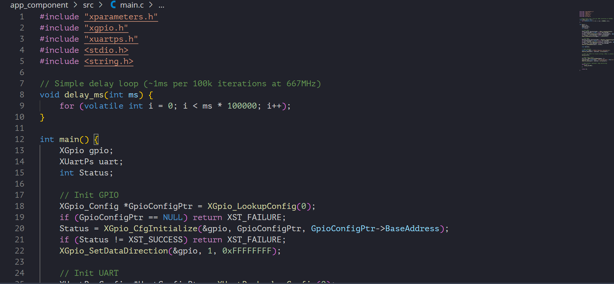
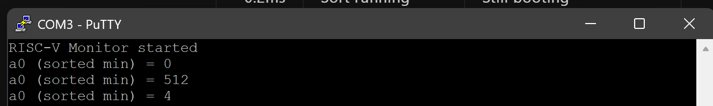

# RV32I — 5-Stage Pipelined RISC-V CPU

A fully functional 32-bit RISC-V CPU implementing the RV32I base integer ISA in SystemVerilog. Classic 5-stage pipeline with complete data hazard forwarding, load-use stall detection, and branch flush on taken branches. Hardware-verified on a Digilent Zedboard running a bubble sort program with results output over UART.



---

## Repository structure

```
riscv-cpu/
├── rtl/                    ← synthesizable RTL
│   ├── alu.sv
│   ├── alu_decoder.sv
│   ├── imm_gen.sv
│   ├── regfile.sv
│   ├── if_stage.sv
│   ├── id_stage.sv
│   ├── ex_stage.sv
│   ├── mem_stage.sv
│   ├── wb_stage.sv
│   ├── hazard_unit.sv
│   ├── forwarding_unit.sv
│   └── riscv_cpu.sv
├── fpga/
│   ├── fpga_top.sv
│   ├── fpga_top_wrapper.v
│   ├── design_1.bd
│   └── zedboard.xdc
├── sim/
│   ├── tb_riscv_cpu.sv
│   └── tb_alu.sv
├── program/
│   └── bubble_sort.asm
├── docs/
│   ├── architecture.png      ← pipeline architecture diagram
│   ├── simplified.png        ← simplified datapath
│   ├── reviewed_arch.png     ← reviewed RTL architecture
│   ├── block_design.png      ← Vivado block design (Zynq PS + AXI GPIO)
│   ├── routed_design.png     ← post-route implementation view
│   ├── vitis.png             ← Vitis bare-metal UART app
│   ├── putty.png             ← PuTTY UART output on hardware
│   └── notes.md             ← design notes for all pipeline stages
└── README.md
```

---

## Architecture


Five classic in-order pipeline stages with full hazard handling:

```
         ┌──────┐   ┌──────┐   ┌──────┐   ┌──────┐   ┌──────┐
  PC ───▶│  IF  │──▶│  ID  │──▶│  EX  │──▶│ MEM  │──▶│  WB  │
         └──────┘   └──────┘   └──────┘   └──────┘   └──────┘
              IF/ID      ID/EX      EX/MEM     MEM/WB
                │                    │              │
                ▼                    │              │
         ┌────────────┐              │    ┌─────────────────┐
         │  Hazard    │◀─────────────┘    │    Forwarding   │
         │ Detection  │                   │  EX-EX, MEM-EX  │
         └────────────┘                   └─────────────────┘
```





### Pipeline stages

| Stage | Module | Function |
|---|---|---|
| IF | `if_stage.sv` | PC register, instruction memory, next-PC mux |
| ID | `id_stage.sv` | Register file, immediate gen, control unit |
| EX | `ex_stage.sv` | ALU, forwarding muxes, branch resolution |
| MEM | `mem_stage.sv` | Data memory, byte/half/word load-store |
| WB | `wb_stage.sv` | Writeback mux, register file write |

### Hazard handling

**Load-use stall — 1 cycle:**
```
if (ID_EX.mem_read &&
   (ID_EX.rd == IF_ID.rs1 || ID_EX.rd == IF_ID.rs2))
    → PCWrite=0, IF_ID_write=0, insert NOP into ID/EX
```

**Branch flush — 1 cycle penalty:**
```
if (branch_taken)
    → flush IF/ID and ID/EX
    → PC ← branch_target
```

**Forwarding paths:**
```
EX/MEM → EX  (ForwardA/B = 2'b10)  highest priority
MEM/WB → EX  (ForwardA/B = 2'b01)
Regfile      (ForwardA/B = 2'b00)  no hazard
```

---

## Module hierarchy

```
riscv_cpu.sv
├── if_stage.sv
├── id_stage.sv
│   ├── regfile.sv
│   └── imm_gen.sv
├── ex_stage.sv
│   ├── alu.sv
│   └── alu_decoder.sv
├── mem_stage.sv
├── wb_stage.sv
├── hazard_unit.sv
└── forwarding_unit.sv
```

---

## ISA coverage

Full RV32I base integer instruction set:

| Category | Instructions |
|---|---|
| R-type | ADD SUB AND OR XOR SLL SRL SRA SLT SLTU |
| I-type ALU | ADDI ANDI ORI XORI SLTI SLTIU SLLI SRLI SRAI |
| Load | LW LH LB LHU LBU |
| Store | SW SH SB |
| Branch | BEQ BNE BLT BGE BLTU BGEU |
| Jump | JAL JALR |
| Upper imm | LUI AUIPC |

---

## FPGA implementation

### Block design



UART output is implemented via the Zynq PS — no custom UART TX module needed. The block design connects:

```
riscv_cpu.debug_out[31:0]
    → fpga_top.sv
        → AXI GPIO (axi_gpio_0)
            → AXI SmartConnect
                → Zynq PS (processing_system7_0)
                    → UART over USB via Vitis bare-metal
```

`debug_out` is wired to `regs[10]` (register `a0`) inside `riscv_cpu`. After bubble sort completes, `a0` holds the first element of the sorted array.

### Routed design



### Vitis bare-metal app



```c
#include "xgpio.h"

XGpio gpio;
XGpio_Initialize(&gpio, XPAR_AXI_GPIO_0_DEVICE_ID);
XGpio_SetDataDirection(&gpio, 1, 0xFFFFFFFF);

u32 result = XGpio_DiscreteRead(&gpio, 1);
xil_printf("Sorted A[0] = %d\r\n", result);
```

### UART output



---

## Verification

### Simulation

Behavioral simulation in Vivado XSim. Testbench runs 500 clock cycles of bubble sort on a 10-element array `{5,3,8,1,9,2,7,4,6,0}`.

Expected result: `a0 = 0` (minimum element at `A[0]` after sort).

Hazard cases exercised:
- EX-EX forwarding on back-to-back ALU instructions
- Load-use stall on `lw` followed by immediate use
- Branch flush on every inner and outer loop iteration

### Hardware

**Board:** Digilent Zedboard (XC7Z020CLG484-1)  
**Tool:** Vivado 2025.1  
**Interface:** Zynq PS UART via Vitis bare-metal, monitored in PuTTY  

Result: sorted array minimum correctly output over UART. LED sequence confirms program completion.

---

## Build

### Simulation

1. Open project in Vivado 2025.1
2. Add all files from `rtl/` and `sim/` to sources
3. Set `tb_riscv_cpu.sv` as simulation top under Simulation Sources
4. Run Behavioral Simulation
5. Check Tcl console for `debug_out (a0) = 0`

### FPGA

1. Add all files from `rtl/` and `fpga/` to sources
2. Import `fpga/design_1.bd` via File → Add Sources → Add or create block designs
3. Set `design_1_wrapper` as synthesis top
4. Run Synthesis → Implementation → Generate Bitstream
5. Open Hardware Manager → program Zedboard
6. Build and run Vitis bare-metal app
7. Open PuTTY at 115200 baud, observe UART output

---

## Key design decisions

**Write-first register file** — WB writes and ID reads in the same cycle. The register file returns new write data immediately on address collision, simplifying the forwarding unit.

**Branch resolved in EX** — 1-cycle penalty on all taken branches. Resolving in ID would require partial decode forwarding; EX resolution is cleaner for this implementation.

**Harvard architecture** — separate IMEM and DMEM. Instruction fetch and data access never conflict, eliminating structural hazards on memory.

**SUB reuses ADD hardware** — `A - B = A + (~B) + 1`. Single adder with carry-in = 1 for subtract. Synthesis collapses this automatically.

**funct7[5] gated by opcode[5]** — For I-type ADDI, `instr[30]` is part of the immediate, not a function modifier. Without the gate, ADDI with a negative immediate silently decodes as SUB.

**Zynq PS for UART** — rather than implementing a custom UART TX in PL, the CPU result register is exposed via AXI GPIO to the Zynq PS, which handles serial transmission through its hardened UART peripheral.

---

## What's out of scope

- Exceptions and CSRs
- M extension (multiply/divide)
- Caches — single-cycle IMEM and DMEM
- Out-of-order or superscalar execution

---

## Author

Jehkaran Singh — Electronics and Computer Engineering (Microelectronics), UPES Dehradun  
Portfolio: [theologysubtext.space](https://theologysubtext.space/portfolio)  
GitHub: github.com/Jehka
