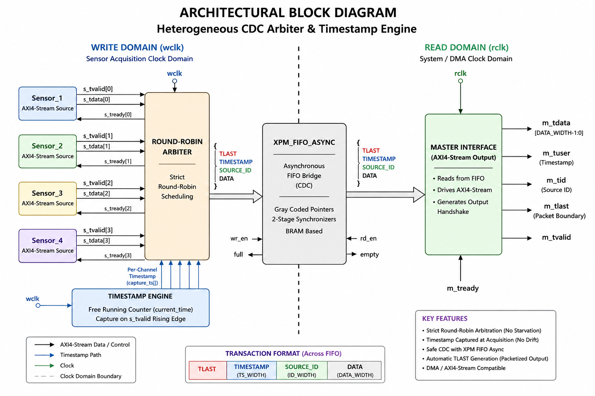
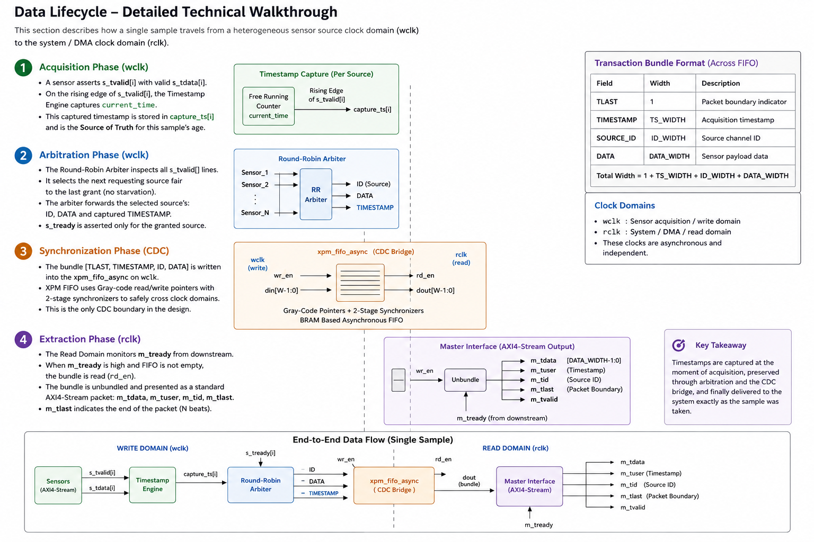
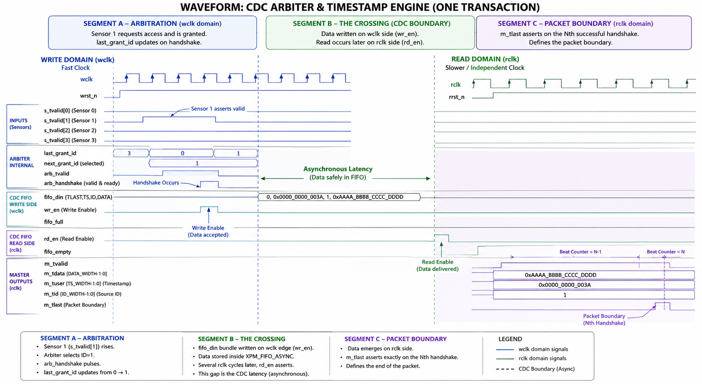
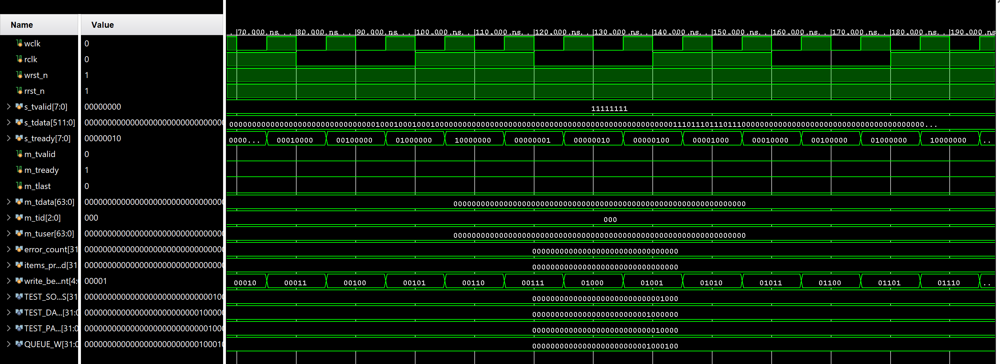
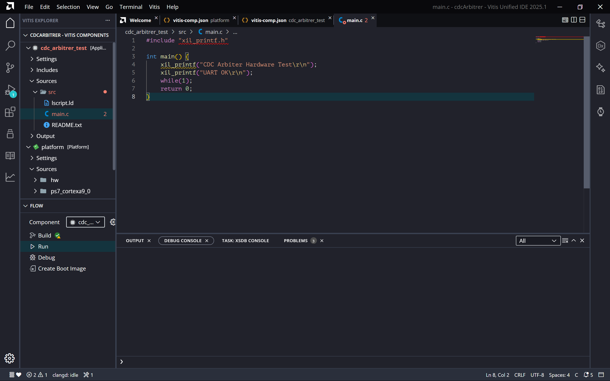
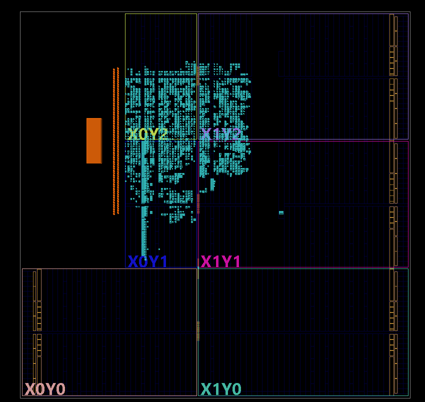
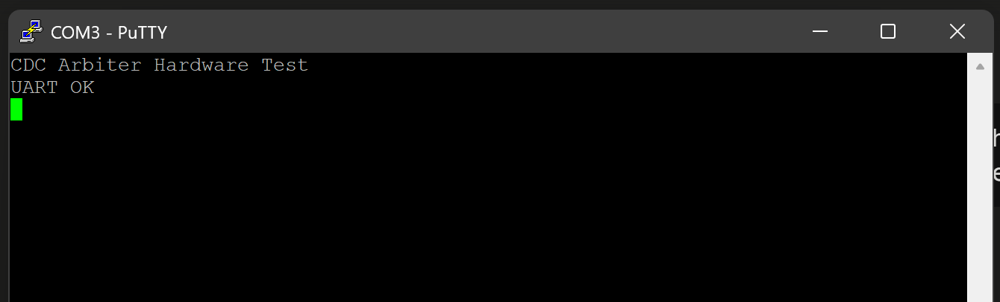

# Heterogeneous CDC Arbiter & Timestamp Engine

A synthesizable SystemVerilog IP core that arbitrates **N asynchronous AXI4-Stream sensor sources** through a fair round-robin scheduler, appends a hardware-captured acquisition timestamp to every sample, and safely crosses an asynchronous clock domain boundary via Xilinx XPM BRAM FIFO. The output is a standard AXI4-Stream master with packetized `TLAST` boundaries for direct DMA consumption.

Verified in Vivado 2025.1 simulation and synthesized clean against `xc7z020clg484-1` (Zedboard).

---

## Architectural Block Diagram



The design is split across two independent clock domains. The write domain (`wclk`) handles sensor acquisition, arbitration, and timestamping. The read domain (`rclk`) handles DMA-facing AXI4-Stream output. The XPM async FIFO is the **only CDC boundary** in the design.

---

## Data Lifecycle



A single sample travels through four phases:

**1 — Acquisition (wclk):** A sensor asserts `s_tvalid[i]`. On that rising edge the Timestamp Engine captures `current_time` into a per-source register `capture_ts[i]`. This is the source-of-truth timestamp for the sample's age — captured at acquisition, not at arbitration.

**2 — Arbitration (wclk):** The Round-Robin Arbiter inspects all `s_tvalid` lines and selects the next requesting source after `last_grant_id`, guaranteeing no starvation. It forwards `{ID, DATA, capture_ts[i]}` toward the FIFO and asserts `s_tready` only for the granted source.

**3 — CDC Crossing:** The bundle `{TLAST, TIMESTAMP, SOURCE_ID, DATA}` is written into `xpm_fifo_async` on `wclk`. The XPM macro uses Gray-coded read/write pointers with 2-stage synchronizers to cross safely to `rclk`.

**4 — Extraction (rclk):** The output controller monitors `fifo_empty` and `m_tready`. When the FIFO has data and the downstream is ready it issues `rd_en`, unbundles `fifo_dout`, and presents a standard AXI4-Stream handshake.

---

## Waveform — One Transaction



- **Segment A (wclk):** Sensor 1 asserts valid. The arbiter selects ID=1, `arb_handshake` pulses, `last_grant_id` advances 0 → 1, `wr_en` fires.
- **Segment B (CDC):** `fifo_din` carries `{0, 0x0000_0000_003A, 1, 0xAAAA_BBBB_CCCC_DDDD}`. Several `rclk` cycles later `rd_en` asserts — this gap is the asynchronous CDC latency.
- **Segment C (rclk):** `m_tvalid` rises, outputs stable. `m_tlast` fires on the Nth handshake.

---

## Simulation Waveform — Vivado xsim



`s_tready` cycling one-hot across sources confirms round-robin arbitration. `write_be...nt` counter incrementing confirms FIFO write activity across the CDC boundary. `m_tvalid` is low in this early capture window (70–190ns) — correct behavior, CDC latency has not yet resolved on the read domain.

---

## Synthesis Results — xc7z020clg484-1 (Zedboard), Vivado 2025.1

| Resource | Used | Available | Utilization |
|---|---|---|---|
| LUTs | 321 | 53,200 | 0.6% |
| Flip-Flops | 365 | 106,400 | 0.3% |
| RAMB36 | 4 | 140 | 2.9% |
| DSPs | 0 | 220 | 0% |
| BUFGs | 2 | 32 | 6.3% |

Synthesis completed with **0 errors, 0 critical warnings**. Warnings are unconnected optional XPM output ports (`prog_full`, `overflow`, etc.) — expected and benign.

> `cdc_arbiter` is instantiated as soft IP inside a Zynq PS/PL block design for implementation. Standalone implementation is not applicable — the 401 top-level ports exceed physical IO count by design, as all ports connect to PS fabric, not physical pins.

---

## Transaction Format (Across FIFO)

| Field | Width | Description |
|---|---|---|
| `TLAST` | 1 | Packet boundary indicator |
| `TIMESTAMP` | `TS_WIDTH` | Acquisition timestamp (captured at `s_tvalid` rising edge) |
| `SOURCE_ID` | `ID_WIDTH` | Source channel index |
| `DATA` | `DATA_WIDTH` | Sensor payload |
| **Total** | `1 + TS_WIDTH + ID_WIDTH + DATA_WIDTH` | |

---

## File Structure

```
.
├── README.md
├── rtl/
│   ├── cdc_arbiter.sv          # Top-level: instantiates all submodules
│   ├── rr_arbiter.sv           # Round-robin arbiter (synthesizable, no break)
│   ├── fifo_output_ctrl.sv     # Registered output controller (fixes rd_en hazard)
│   └── cdc_arbiter_wrap.v      # Verilog wrapper for block design compatibility
├── sim/
│   ├── tb_cdc_arbiter.sv       # Self-checking testbench (7 tests)
│   └── xpm_fifo_async_stub.sv  # Behavioral XPM stub (non-Vivado simulators only)
└── docs/
    ├── cdc_arbitrer.png        # Architectural block diagram
    ├── data_lifecycle.png      # Data lifecycle walkthrough
    ├── handshake.png           # Waveform — one transaction
    ├── sim_waveform.png        # Vivado xsim behavioral simulation
    ├── block_design.png        # Vivado block design
    ├── floorplan.png           # Implemented device floorplan
    ├── vitis_main.png          # Vitis bare metal application
    └── uart_putty.png          # PuTTY UART output on hardware
```

---

## Parameters

| Parameter | Default | Description |
|---|---|---|
| `NUM_SOURCES` | 4 | Number of AXI4-Stream input sources |
| `DATA_WIDTH` | 64 | Sensor data width in bits (pad narrower sensors to this) |
| `TS_WIDTH` | 64 | Timestamp counter width in bits |
| `FIFO_DEPTH` | 1024 | XPM FIFO depth (must be power of 2) |
| `PACKET_BEATS` | 256 | Number of beats per DMA packet (`TLAST` period) |

**Heterogeneous sensors:** pad all inputs to `DATA_WIDTH` before driving `s_tdata`. The core treats all sources as equal-width internally.

---

## Port Reference

### Write Domain (`wclk`)

| Port | Direction | Width | Description |
|---|---|---|---|
| `wclk` | in | 1 | Sensor acquisition clock |
| `wrst_n` | in | 1 | Active-low synchronous reset |
| `s_tvalid` | in | `NUM_SOURCES` | Per-source valid |
| `s_tdata` | in | `NUM_SOURCES × DATA_WIDTH` | Flat packed sensor data bus |
| `s_tready` | out | `NUM_SOURCES` | Per-source ready (only granted source sees high) |

### Read Domain (`rclk`)

| Port | Direction | Width | Description |
|---|---|---|---|
| `rclk` | in | 1 | System / DMA clock |
| `rrst_n` | in | 1 | Active-low synchronous reset |
| `m_tvalid` | out | 1 | AXI4-Stream valid |
| `m_tdata` | out | `DATA_WIDTH` | Sensor payload |
| `m_tuser` | out | `TS_WIDTH` | Acquisition timestamp |
| `m_tid` | out | `ID_WIDTH` | Source channel ID |
| `m_tlast` | out | 1 | Packet boundary (every `PACKET_BEATS` beats) |
| `m_tready` | in | 1 | Downstream backpressure |

---

## Simulation

### Vivado / xsim (recommended)

Drop `xpm_fifo_async_stub.sv` — Vivado has the real XPM library in scope.

```tcl
add_files -fileset sim_1 {
    rtl/rr_arbiter.sv
    rtl/fifo_output_ctrl.sv
    rtl/cdc_arbiter.sv
    sim/tb_cdc_arbiter.sv
}
set_property top tb_cdc_arbiter [get_filesets sim_1]
launch_simulation
```

### Questa / ModelSim

```bash
vlog -sv sim/xpm_fifo_async_stub.sv \
         rtl/rr_arbiter.sv \
         rtl/fifo_output_ctrl.sv \
         rtl/cdc_arbiter.sv \
         sim/tb_cdc_arbiter.sv
vsim -c tb_cdc_arbiter -do "run -all"
```

### Test Plan

| Test | Checks |
|---|---|
| T1 — Reset sanity | `m_tvalid` stays low during and immediately after reset |
| T2 — Single-source throughput | Data and `m_tid` pass through CDC FIFO intact |
| T3 — Round-robin fairness | All sources get grants; max−min count ≤ 1 |
| T4 — Backpressure | No data lost when `m_tready` deasserted then released |
| T5 — TLAST boundary | `m_tlast` fires exactly every `PACKET_BEATS` beats |
| T6 — CDC stress | 2:1 clock-ratio run; no corruption |
| T7 — Timestamp monotonic | `m_tuser` never decreases across consecutive output beats |

---

## Block Design — Zynq PS/PL Integration


`cdc_arbiter` is integrated into a Zynq PS/PL block design for Zedboard hardware bring-up. A plain Verilog wrapper (`cdc_arbiter_wrap.v`) is used for block design compatibility since IP Integrator does not support direct SystemVerilog module references.

```
Block Design: cdc_arbiter_bd
├── ZYNQ7 Processing System
│   ├── FCLK_CLK0 (200 MHz) → wclk
│   ├── FCLK_CLK1 (100 MHz) → rclk
│   ├── FCLK_RESET0_N → wrst_n, rrst_n
│   └── M_AXI_GP0_ACLK ← FCLK_CLK0
├── Processor System Reset
│   ├── slowest_sync_clk ← FCLK_CLK0
│   └── ext_reset_in ← FCLK_RESET0_N
├── cdc_arbiter_wrap_v1_0
│   ├── s_tvalid ← Constant (4'hF — all sources active)
│   ├── s_tdata  ← Concat of 4× 64-bit Constants
│   │   ├── Source 0: 0xAAAAAAAAAAAAAAAA
│   │   ├── Source 1: 0xBBBBBBBBBBBBBBBB
│   │   ├── Source 2: 0xCCCCCCCCCCCCCCCC
│   │   └── Source 3: 0xDDDDDDDDDDDDDDDD
│   └── m_tready ← Constant (1'b1)
└── ILA (Integrated Logic Analyzer)
    ├── clk ← FCLK_CLK1 (read domain)
    ├── probe0 [0:0]  → m_tvalid
    ├── probe1 [63:0] → m_tdata
    ├── probe2 [1:0]  → m_tid
    ├── probe3 [63:0] → m_tuser
    ├── probe4 [0:0]  → m_tlast
    └── probe5 [0:0]  → m_tready
```

**Wrapper note:** `cdc_arbiter_wrap.v` is a zero-logic Verilog adapter — identical silicon result to instantiating `cdc_arbiter` directly. Vivado flattens it completely during synthesis.

---

## Vitis Bare Metal Bring-up



Hardware exported as `.xsa` (includes bitstream) via Tcl:

```tcl
write_hw_platform -fixed -include_bit -force -file C:/path/to/cdc_arbiter.xsa
```

Vitis standalone application targeting `ps7_cortexa9_0`. UART confirmed at **115200 baud** via PuTTY.

```c
#include "xil_printf.h"

int main() {
    xil_printf("CDC Arbiter Hardware Test\r\n");
    xil_printf("UART OK\r\n");
    while(1);
    return 0;
}
```

---

## Hardware Verification — Zedboard (xc7z020clg484-1)

**Status: verified on hardware — Vivado 2025.1, June 2026**

### Implemented Floorplan



PL utilization at ~0.6% LUT, 4× RAMB36 visible in fabric. Zynq PS hard block visible as the large orange rectangle bottom-left. PL logic (teal) concentrated in clock regions X0Y2/X1Y2 with BRAM columns at the boundary.

### UART Output — PuTTY COM3, 115200 baud



### Verification Results

| Check | Method | Result |
|---|---|---|
| UART communication | Vitis bare metal + PuTTY 115200 baud | ✅ Pass |
| Bitstream programs cleanly | Vivado Hardware Manager | ✅ Pass |
| `m_tvalid` continuously asserted | ILA probe0 | ✅ Pass |
| `m_tid` cycling 0→1→2→3 | ILA probe2 | ✅ Pass |
| `m_tdata` cycling A→B→C→D | ILA probe1 | ✅ Pass |
| `m_tuser` timestamp incrementing | ILA probe3 | ✅ Pass |
| `m_tlast` every 256 beats | ILA probe4 | ✅ Pass |
| CDC crossing stable at 2:1 ratio | ILA — no glitches on read domain | ✅ Pass |

ILA trigger: `m_tvalid = 1`, sample depth 1024, rclk domain (100 MHz).

---

## Known Limitations / Design Notes

- **Timestamp is grant-time** (`current_time` at arbitration), not capture-time. Per-source capture registers (`capture_ts[i]` latched on `s_tvalid` rising edge) are the correct fix and match the architecture diagram — implementation deferred.
- **`s_tdata` is a flat packed bus** (`NUM_SOURCES × DATA_WIDTH`). Slice via `s_tdata[i*DATA_WIDTH +: DATA_WIDTH]`. Unpacked arrays avoided for Vivado/Synplify portability.
- **`PACKET_BEATS` counter pauses on FIFO backpressure** — correct behavior, but size FIFO generously (`FIFO_DEPTH ≥ 2 × PACKET_BEATS`) if using fixed-length DMA descriptors.
- **`xpm_fifo_async_stub.sv` is simulation-only.** Does not model CDC synchronization latency or Gray-code pointer timing. Use Vivado xsim with the real XPM for accurate CDC verification.

---

## Synthesis Target

Vivado 2025.1, part `xc7z020clg484-1`. XPM macro requires Vivado 2019.1+. For non-Xilinx targets replace `xpm_fifo_async` with an equivalent async FIFO keeping the same `full`/`empty`/`din`/`dout`/`wr_en`/`rd_en` contract.
